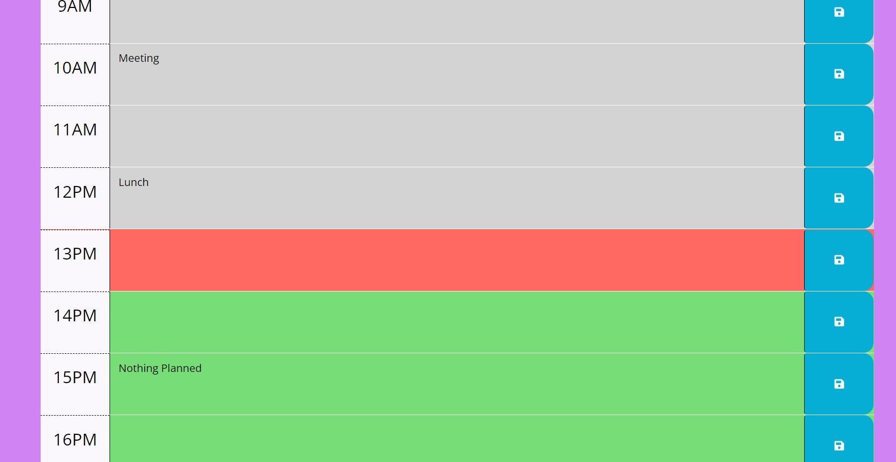

# Work-Day-Scheduler
Work Day Scheduler

The Work Day Schedular or Daily Planner project was a great way for me to use simple APIs, just becoming fimlar with them and seeing how 

everything works together. I got the time to interact with my page and also the console log. It took me awhile to get that part to work but 

after a little trouble shooting and reach search I was able to get it. I also got the date to interact with my page and I was able to find that 

in one of our lessons. I could not get the save buttons to work and with time running out on me I just had to move on to get the functions working for everything out.

Over all I am proud of myself for getting this far and just enjoying every step of the.

