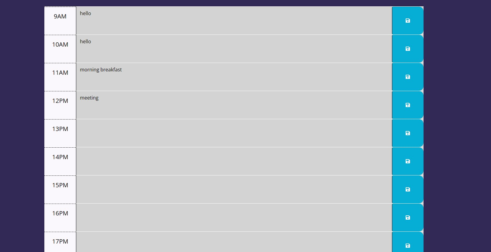

# Work-Day-Scheduler
Work Day Scheduler

## Table of Content
- [Description](#description)
- [Visuals](#visuals)
- [Links](#links)

***
## Description
The goal for this challenge was to create a simple calendar application that allows a user to save events for each hour of the day. This app will run in the browser and feature dynamically updated HTML and CSS powered by jQuery. This is to help a user who is busy to plan out events ahead of time or someone who works a busy life style to keep them in track so they are not over planning nor forget what is going on. 
***

## Visuals
Header

Body

***

## Links

Link to GitHub: [Work-Day-Scheduler](https://github.com/KMPhillips20/Work-Day-Scheduler)

